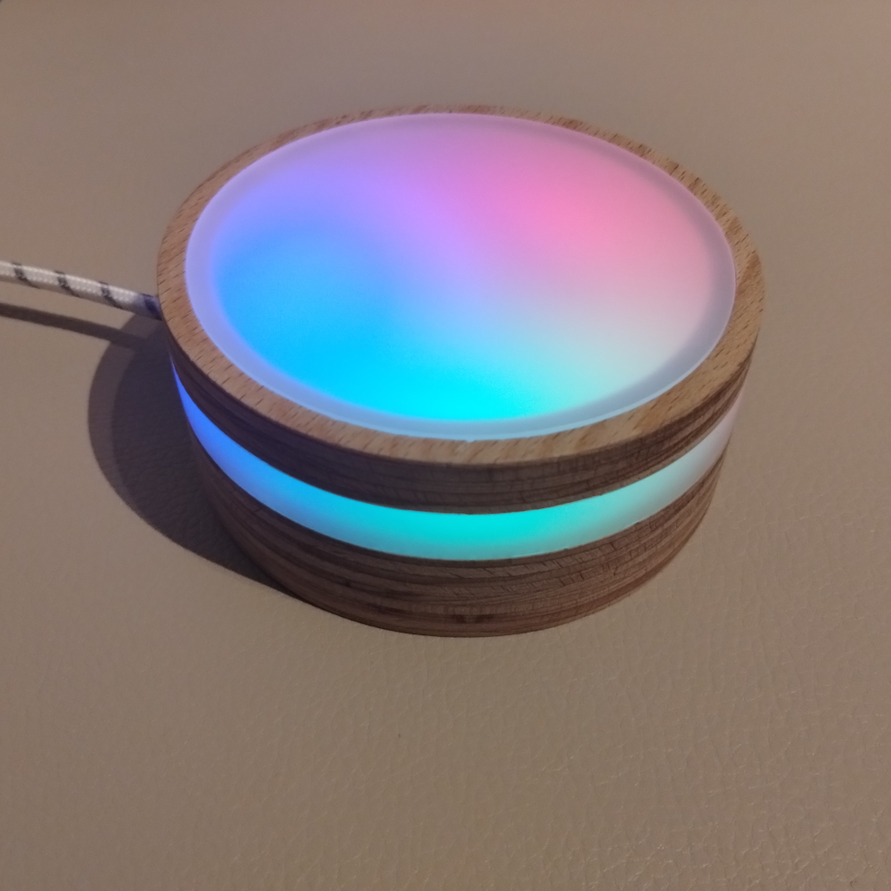

# LuminaBreath

LuminaBreath, is a compact, innovative meditation and night light designed to support and enhance your breathing exercises using light patterns. This device serves as a bridge between technology and mindfulness, offering a unique way to relax, meditate, and prepare for sleep.

Once you plug in the device it starts its breathing animation. Breath in with the light and breath out when the light dims. After 9 minutes the device turns off automatically.

  
   

## Components

- Case from CNCed wood & acryl glass
- ESP32 NodeMCU
- NeoPixel 24 LED Ring

## Features

- [x] **Breathing Guide Light**: rhythmic light patterns to guide your breathing, helping you to slow down your breath, relax your mind, and reduce stress.
- [x] **Portable and Compact Design**: Designed to be small and lightweight, it can easily be placed on a bedside table or taken with you on the go to maintain your meditation routine anywhere.
- [x] **User-Friendly**: Simple to use, with intuitive controls that allow you to start your meditation session in just one step.
- [ ] **HomeAssistant Integration**: Control the device via HomeAssistant
  - [ ] **Customizable Settings**: Adjust the light patterns to match your preferred breathing pace, making your meditation or relaxation session personalized and more effective.
  - [ ] **Night Light Functionality**: With its soft glow, Lumina Breath doubles as a night light, providing a calm and soothing atmosphere perfect for bedtime.
